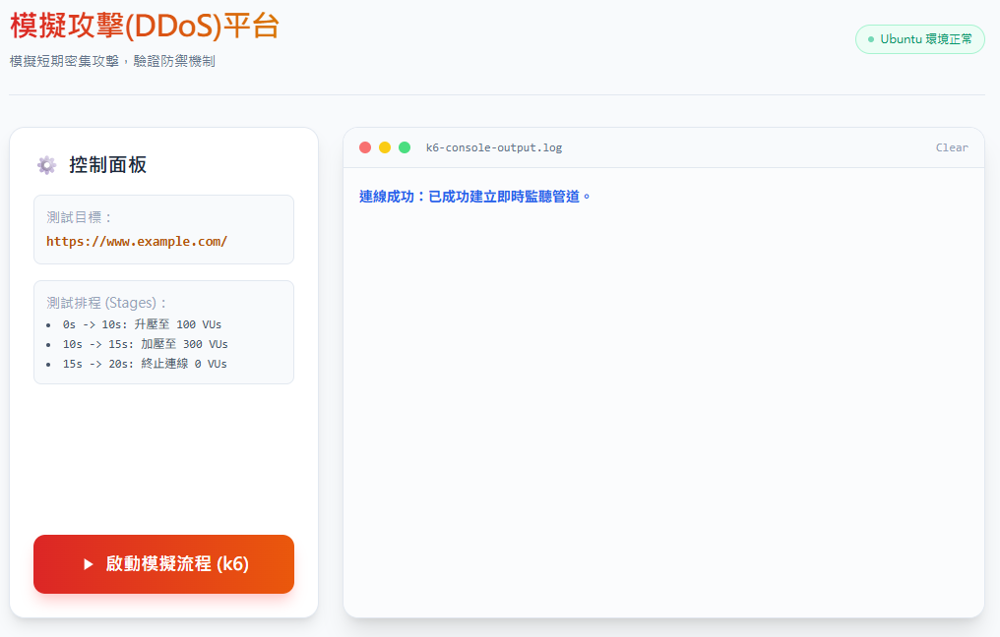

# Grafana k6 壓力測試(with webui)

k6 壓力測試專案，並使用 Express 與 WebSocket 即時轉送後端過程至前端。

## 環境安裝

Ubuntu / Debian 可先安裝 Node.js 與 npm：

```bash
apt-get install nodejs
apt install npm
```

安裝 Grafana k6：

```bash
dpkg -i deb/k6-v2.0.0-linux-amd64.deb
```

專案後端會呼叫 `k6 run`。

## 安裝依賴

由於專案已經有 `package.json`，直接執行：

```bash
npm install
```

## 檢視腳本，確認URL
```
vim k6-stress-DoS.js
```

## 啟動專案

```bash
node server.js
```

完成後可在 `http://localhost:3000` 開啟頁面。

## 運作畫面


